# 🏗️ GitHub RAG Chatbot - Architecture Diagram

## 📊 Complete System Architecture

---

## 🔄 Detailed Data Flow

---

## 📁 File Structure to Architecture Mapping

```mermaid
graph TD
    ROOT[GIT_rag_chatbot/]
    
    ROOT --> APP[app.py<br/>📱 Streamlit UI]
    ROOT --> SERVICES[services/]
    ROOT --> UTILS[utils/]
    ROOT --> ENV[.env<br/>🔑 API Keys]
    
    SERVICES --> S1[github_loader.py<br/>🟣 Phase 1]
    SERVICES --> S2[document_processor.py<br/>🔵 Phase 2 - Step 2]
    SERVICES --> S3[embeddings.py<br/>🔵 Phase 2 - Step 3]
    SERVICES --> S4[vector_store.py<br/>🔵 Phase 2 - Step 4]
    SERVICES --> S5[retrieval.py<br/>🟢 Phase 3]
    SERVICES --> S6[llm.py<br/>🟠 Phase 4]
    
    UTILS --> U1[helpers.py<br/>🛠️ Utilities]
    
    style S1 fill:#e6d5f5
    style S2 fill:#d5e5f5
    style S3 fill:#d5e5f5
    style S4 fill:#d5e5f5
    style S5 fill:#d5f5e5
    style S6 fill:#f5e5d5
```

---

## 🎯 Phase-by-Phase Component Diagram

### Phase 1: Repository Ingestion

### Phase 2: Semantic Indexing

### Phase 3: Context Retrieval

### Phase 4: Grounded Generation

---

## 🔐 Authentication & Configuration

---

## 📊 Data Storage Schema

---

## 🚀 Tech Stack Overview

---

## ⚙️ Environment Setup Flow

```mermaid
flowchart TD
    A[Start Setup] --> B{Virtual Env Exists?}
    B -->|No| C[Create: python -m venv rag_env]
    B -->|Yes| D[Activate Env]
    C --> D
    
    D --> E[Install: pip install -r requirements.txt]
    E --> F{Installation Success?}
    
    F -->|No| G[Error: Check ChromaDB]
    F -->|Yes| H[Create .env file]
    
    H --> I[Add GITHUB_TOKEN]
    I --> J[Add GROQ_API_KEY]
    
    J --> K[Run: streamlit run app.py]
    K --> L[🎉 App Ready!]
    
    G --> E
    
    style C fill:#d5e5f5
    style H fill:#fff3cd
    style L fill:#d4edda
```

---

## 📝 File Responsibilities

| File | Phase | Responsibility |
|------|-------|----------------|
| `app.py` | All | Streamlit UI, orchestrates all phases |
| `services/github_loader.py` | 1 | GitHub API access, load repository files |
| `services/document_processor.py` | 2 | Parse and chunk code with AST awareness |
| `services/embeddings.py` | 2 | Generate 384D embeddings using Sentence Transformers |
| `services/vector_store.py` | 2 | ChromaDB initialization and storage |
| `services/retrieval.py` | 3 | Query embedding and similarity search |
| `services/llm.py` | 4 | Groq LLM integration and answer generation |
| `utils/helpers.py` | - | Utility functions across all modules |

---

## 🔄 Request-Response Flow

```mermaid
sequenceDiagram
    actor User
    participant UI as Streamlit UI
    participant Loader as GitHub Loader
    participant Processor as Doc Processor
    participant Embedder as Embeddings
    participant VectorDB as ChromaDB
    participant Retriever as Retrieval
    participant LLM as Groq LLM

    User->>UI: Enter GitHub URL
    UI->>Loader: Load repository
    Loader->>Processor: Send code files
    Processor->>Embedder: Send chunks
    Embedder->>VectorDB: Store embeddings
    VectorDB-->>UI: ✅ Repository indexed

    User->>UI: Ask question
    UI->>Retriever: Process query
    Retriever->>VectorDB: Search similar chunks
    VectorDB-->>Retriever: Return context
    Retriever->>LLM: Send context + query
    LLM-->>UI: Return answer + references
    UI-->>User: Display answer
```

---

## 🎯 Key Features

---

## 📚 API Keys Required

---

*Architecture Version: 1.0*  
*Created: 2026-01-16*  
*All diagrams render in GitHub, VS Code, and Markdown viewers*
